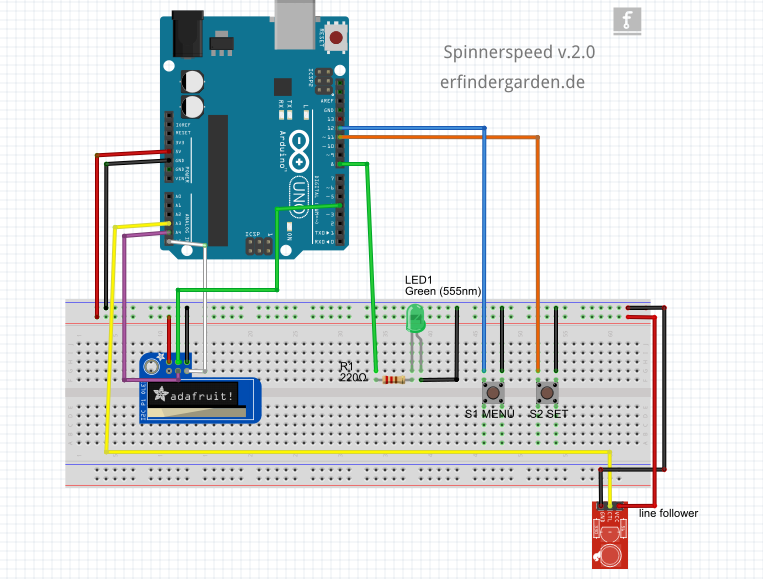
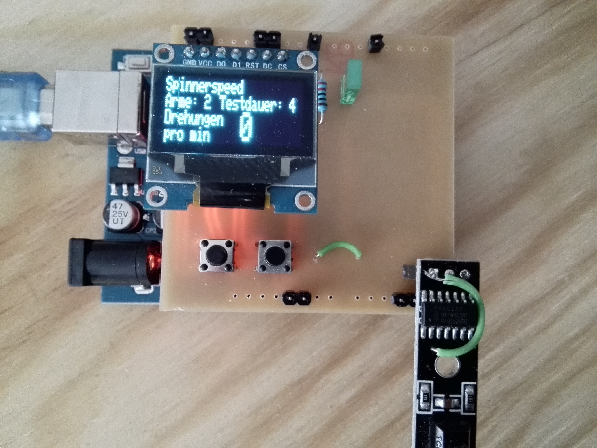

# Spinnerspeed

Der ultimative RPM_Messer für Spinner mit Armen. Gemessen wird die Umdrehung pro Minute. 

Entwickelt im [erfindergarden](https://www.erfindergarden.de), das FabLab in der Au, München.

-

- Menü 1: Anzahl der Arme auswählen

- Menü 2: Testdauer in Sekunden einstellen

- Menü 3: Testlauf

- Menü 4: Geschwindikeitsmessung

   

