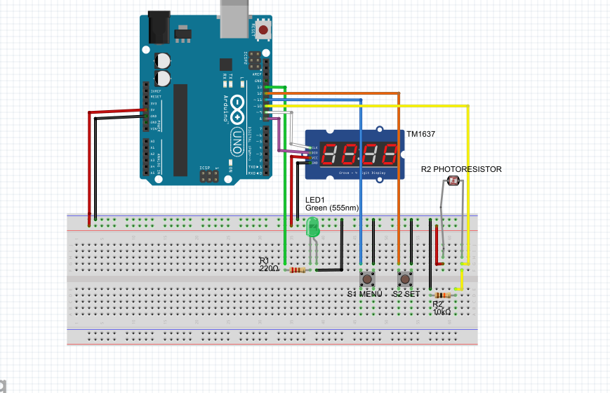

# Spinnerspeed

Der ultimative RPM_Messer für Spinner mit Armen. Gemessen wird die Umdrehung pro Minute. 
Im Testmodus kann die Sensorempfindlichkeit eingestellt werden.
Die Anzahl der Arme wird in der Vorauswahl getroffen.
)
